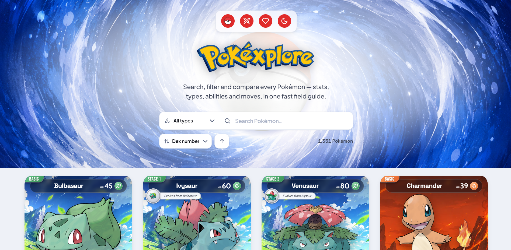
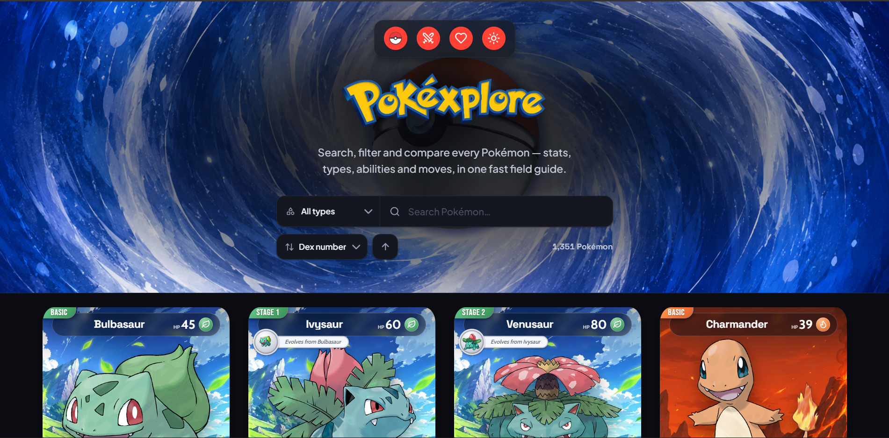
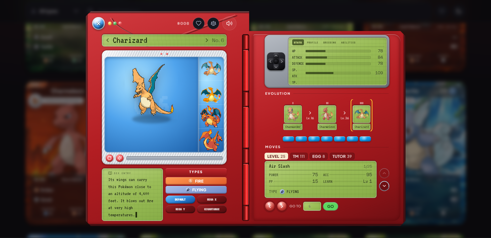
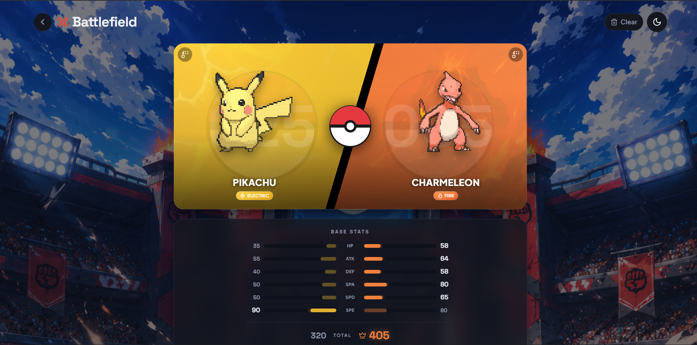

<p align="center">
  
</p>

<p align="center">
  A fast, production-quality <strong>Pokémon Explorer</strong> built on the PokéAPI — browse, search,
  filter, sort and compare every Pokémon in a polished, fully responsive field guide.
</p>

<p align="center">
  <a href="https://pokego-ui.vercel.app/"><strong>🔴 Live Demo → pokego-ui.vercel.app</strong></a>
</p>

<p align="center">
  
  
  
  
  
</p>

---

## Features

### Core

- **Browse** — a responsive trading-card grid, 20 Pokémon per page via a **Load More** button (appends, never replaces).
- **Search** — instant substring search across the entire dex, by name **or** dex number, debounced.
- **Type filter** — filter by any of the 18 types, each with its own colour and Lucide icon.
- **Detail view** — a skeuomorphic **Pokédex device** (a modal at a shareable URL, `/pokemon/pikachu`) with large artwork, types, a Pokédex flavor entry, proportional base-stat bars, a D-pad-paged data console (height / weight / abilities / breeding), the evolution line, type matchups, a browsable move list and the Pokémon's cry.
- **Type-based styling** — a single centralized type configuration drives every colour, gradient and icon in the app.
- **Responsive** — mobile-first from 375 px to 1920 px with no horizontal overflow; the Pokédex re-flows from a stacked, horizontally-hinged layout on mobile to a two-leaf "book" on desktop.
- **Accessible** — semantic HTML, full keyboard support (Tab / Enter / Escape), a focus-trapped modal, visible focus rings, ARIA labelling and `prefers-reduced-motion` support.

### Bonus

- ⭐ **Favourites** — persisted to `localStorage`, with a favourites-only view.
- 🌙 **Dark mode** — independently hand-designed light and dark themes (not an inversion), persisted.
- ↕️ **Sort** — by dex number, name, attack, speed or HP, with a direction toggle.
- ⚖️ **Compare** — send two Pokémon into a head-to-head "Battlefield" comparing stats, height/weight, type matchups and abilities.
- 🔗 **URL-based navigation** — every detail view is directly shareable and deep-linkable.
- ⌨️ **Keyboard accessible** — the modal traps focus, restores it on close, and closes on Escape.

### Loading, Error & Empty States

Nothing ever shows a blank screen or a raw error. Every fetch resolves into one of three deliberate states:

| Kind | Where it appears |
| --- | --- |
| **Loading** | Shimmering skeleton card grid on first load and on filter/type changes · Pokéball spinner on **Load More**, on the opening Pokédex, and in compare slots · per-panel “Loading…” on the device screens while sub-resources resolve |
| **Error** | `not-found` → “Pokémon not found” (bad search / dead link) · `network` → “You’re offline” · `malformed` → “Something looks off” · unknown → “Something went wrong”. Every recoverable error shows a **Try again** button. |
| **Empty** | No search/filter matches → “No Pokémon found” + **Clear filters** · Favourites view with none saved → “No favourites yet” + **Browse all** · Unknown route → “Page not found” + **Back to Pokédex** · No wild encounters → “Not found in the wild” · A Pokémon with no listed moves → a graceful “No known moves” |

## Tech Stack

| Concern        | Choice                                            |
| -------------- | ------------------------------------------------- |
| Framework      | React 19 + TypeScript                             |
| Build tool     | Vite 6                                            |
| Styling        | Tailwind CSS v4 (CSS-first design tokens)         |
| Data fetching  | TanStack Query v5 (caching, dedupe, parallelism)  |
| Client state   | Zustand (persisted: theme, favourites, compare)   |
| Routing        | React Router v7                                   |
| Icons          | Lucide React                                      |

## API Used

[**PokéAPI v2**](https://pokeapi.co/docs/v2) — free and public, no authentication required. All network
access lives in one service layer, [`src/services/pokemonApi.ts`](src/services/pokemonApi.ts), and is
consumed through the hooks in [`src/hooks`](src/hooks). Every failure is normalized into a typed
`ApiError` (`not-found` / `network` / `http` / `malformed`) so the UI can respond precisely.

| Endpoint | Used for |
| --- | --- |
| `GET /pokemon?limit&offset` | The full lightweight dex index (name + id), fetched **once** and cached to power whole-dex search, filter and sort |
| `GET /pokemon/{name\|id}` | Full details — artwork, types, base stats, height, weight, abilities, moves and cry — for the cards, the detail view and compare |
| `GET /type/{type}` | Two uses: **(1)** the members of a type for the type filter, and **(2)** damage relations to compute weakness / resistance / immunity |
| `GET /pokemon-species/{name\|id}` | Pokédex flavor text, genus, rarity (legendary / mythical / baby), the evolution-chain link, breeding data and localized names |
| `GET /evolution-chain/{id}` | The full evolution line and each stage's trigger |
| `GET /move/{name\|id}` | Real move power, accuracy, PP, type and damage class for the move browser and card attacks |
| `GET /ability/{name\|id}` | Ability effect text |
| `GET /pokemon/{name\|id}/encounters` | Wild encounter locations and their level ranges |

## Installation

Requires Node 18+ (developed on Node 22).

```bash
git clone https://github.com/<your-username>/pokego-ui.git
cd pokego-ui
npm install
```

## Running Locally

```bash
npm run dev      # start the dev server at http://localhost:5173
npm run build    # type-check (tsc) + production build to dist/
npm run preview  # preview the production build
npm run lint     # run ESLint
```

## Project Structure

```
src/
├── components/
│   ├── layout/       HeroDock, PageContainer, ThemeToggle, ScrollToTop
│   ├── pokemon/      PokemonCard, PokemonGrid, EnergyPip
│   │   └── detail/   Pokedex, PokedexModal, PokedexEntry
│   │       └── device/   DataConsole, DPad, StatsFields, DataScreens,
│   │                     SpriteViewer, MoveBrowser, EvolutionRail,
│   │                     TypeButtons, LcdScreen, DeviceNav, DeviceCry, FormSelector
│   ├── search/       SearchBar
│   ├── filters/      TypeFilter, SortControl
│   ├── states/       CardSkeleton, ErrorState, EmptyState
│   ├── favorites/    FavoriteButton
│   ├── compare/      CompareTray, BattleArena, FighterPicker
│   └── ui/           Button, Dropdown, PokeballIcon, PokeballSpinner, animated-dock
├── pages/            Home, Battlefield, NotFound
├── services/         pokemonApi.ts        (all fetch calls + typed errors)
├── hooks/            usePokemonData, useDebouncedValue, useThemeEffect, useInView, useHoloPointer
├── store/            useAppStore.ts       (Zustand: theme, favourites, compare)
├── constants/        pokemonTypes.ts, sort.ts, typeBackgrounds.ts
├── types/            pokemon.ts           (PokéAPI response types)
├── utils/            pokemon.ts, species.ts, tcg.ts, typeEffectiveness.ts
├── lib/              queryClient.ts
└── App.tsx  ·  main.tsx  ·  index.css     (design tokens)
```

**Data pipeline.** A single flow powers browsing, search, filter and sort: the lightweight dex **index**
(name + id) is fetched once and cached; it is filtered by favourites → type → search, then sorted; and
full details for only the **visible window** are fetched in parallel via TanStack Query's `useQueries`,
cached independently and **shared** across the grid, detail view and compare — so nothing is fetched twice.

## Engineering Decisions & Tradeoffs

| Decision | Why | Tradeoff |
| --- | --- | --- |
| **Two-tier data model** — cache a lightweight `name + id` index once, then fetch full details lazily per visible card | Instant search / filter / sort across all ~1,300 Pokémon without downloading everything up front | Id and name sort globally, but **stat sorts only rank the Pokémon already loaded** — the API returns no stats for un-fetched entries |
| **Detail as a modal at a real URL** (`/pokemon/:name`) over a persistent grid | Deep-linkable and shareable, and closing keeps the grid's scroll position and filters intact | The Home grid stays mounted beneath the modal |
| **Lazy card enrichment** via `IntersectionObserver` — species, evolution, moves and type-matchups fetch only once a card scrolls into view | Keeps first paint fast: a page of cards doesn't fire 100+ requests at once | The trading-card flourishes fill in a beat after a card enters view |
| **Hand-tuned dual theme** via semantic CSS tokens rather than a colour inversion | Light and dark each look intentional and on-brand | Every design token is defined twice |

## Challenges Faced

- **Designing the Pokédex device.** The detail view is a fully skeuomorphic Pokédex, built entirely in CSS:
  a fold-open red shell with a moulded bevel, green dot-matrix LCD readouts, a D-pad that pages the data
  console, a segmented spine hinge, and an open/close swing. Making it feel like a real object **and** stay
  usable and responsive — re-flowing from a stacked, horizontally-hinged mobile layout to a two-leaf desktop
  "book" that swings on the spine — was the single biggest design-and-engineering effort in the project.
- **The list endpoint returns almost nothing.** `GET /pokemon` gives only names and URLs — no types, art or
  stats. Solved with the cached index + lazy per-Pokémon detail resolution, deduped and cached by React Query.
- **Searching the whole dex without hammering the API.** Rather than a request per keystroke, the cached
  index enables instant client-side substring search, fetching details only for the matches actually shown.
- **Sorting by stats the list doesn't contain.** Id/name sorts run on the index; stat sorts apply to the
  resolved window that Load More grows — a predictable model for a Load-More UX.
- **A theme system that isn't just inverted colours.** Semantic CSS variables define light and dark
  independently and flow into Tailwind v4's `@theme`, so both themes are tuned by hand.

## Future Improvements

- **Expand the universe beyond Pokémon** — the app currently fetches only Pokémon data; PokéAPI also exposes
  **Items, Berries, Machines (TM/HMs), Locations, Natures and more**, which could become their own explorable,
  cross-linked sections (e.g. an item that a Pokémon can hold, or a berry it likes).
- **Global stat sorting** across the whole dex (today stat sorts rank only the loaded window) — practical via
  PokéAPI's GraphQL endpoint, which can return `id + name + base stats` for every Pokémon in a single request.
- **Shareable compare URLs** (`/compare/pikachu/charizard`).
- **Virtualized grid** for very large filtered sets.
- **Offline support** via a service worker.

## Screenshots

Best experienced live at **[pokego-ui.vercel.app](https://pokego-ui.vercel.app/)**.

| Home — Light | Home — Dark |
| :---: | :---: |
|  |  |

| Pokédex Detail | Battlefield Compare |
| :---: | :---: |
|  |  |

> Add your captures to [`docs/screenshots/`](docs/screenshots/) using the filenames above and they'll appear here.

---

<p align="center">Built with the <a href="https://pokeapi.co/">PokéAPI</a>. Not affiliated with Nintendo, Game Freak or The Pokémon Company.</p>
